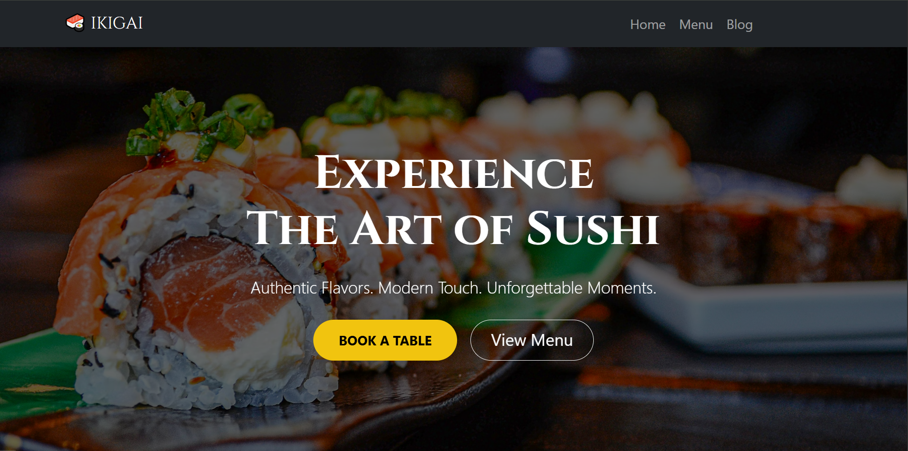

# 🍣 Little Lemon - Japanese Dining Website

> A full-stack Django web application for a Japanese Restaurant, featuring a responsive modern UI, advanced reservation system, and dynamic content management.



## 📖 Overview
This project demonstrates a production-ready restaurant website built with **Django**. It moves beyond basic CRUD by implementing business logic specific to Japanese hospitality (*Omotenashi*), such as specific seating reservations (Omakase Counter vs Tables) and a categorized seasonal menu.

## ✨ Key Features

### 🍱 Dynamic Menu System
- **Relational Database:** Uses `ForeignKey` to link Menu Items with Categories (Sushi, Appetizers, Drinks).
- **Visuals:** Grid layout with hover effects, displaying prices, descriptions, and "Spicy/Sold Out" badges.
- **Backend Management:** Easily add/remove items via Django Admin.

### 📅 Advanced Reservation
- **Split-Layout Design:** Professional UI combining visual appeal with functionality.
- **Smart Booking:** Users can select seating types:
  - *Omakase Counter* (Live Chef Experience)
  - *Private Tatami Room*
  - *Regular Table*
- **Date & Time Pickers:** Integrated browser-native widgets.

### 📰 Culinary Journal (Blog)
- **Magazine Style Layout:** Featured "Latest Story" displayed prominently with a large hero image.
- **Grid System:** Older posts automatically flow into a responsive grid.
- **Interactive:** Zoom-in animations on images and optimized typography for reading.

### 🎨 Frontend & UI/UX
- **Framework:** Bootstrap 5 for responsive layout + Custom CSS for branding.
- **Animations:** AOS (Animate On Scroll) for a smooth, premium feel.
- **Typography:** Google Fonts (*Cinzel* for headings, *Lato* for body) to convey elegance.

## 🛠 Tech Stack
- **Backend:** Python 3, Django 5
- **Database:** SQLite (Development)
- **Frontend:** HTML5, CSS3, Bootstrap 5, JavaScript
- **Package Manager:** Pipenv

## 🚀 Installation & Setup

Prerequisites: Python 3 installed.

1. **Clone the repository**
   ```bash
   git clone [https://github.com/Solakhuddin/IKIGAI.git](https://github.com/Solakhuddin/IKIGAI.git)
   cd IKIGAI
   ````

2. **Install Dependencies (Using Pipenv)**
  ````bash
  pip install pipenv
  pipenv install
  pipenv shell
  ````bash
3. **Apply Migrations**
  ````bash
  python manage.py makemigrations
  python manage.py migrate
  ````

4. **Create Superuser (For Admin Panel)**
  ````bash
  python manage.py createsuperuser
  ````

5. **Run the Server**  
  ````bash
  python manage.py runserver
  ````

## 👮‍♂️ Admin Dashboard Feature

Don't forget to check the Admin Dashboard to add some menu or blog by go to https://domain.com/admin or http://127.0.0.1:8000/admin if it is run on your local server, login with your superuser and you are good to go 😊😊 
